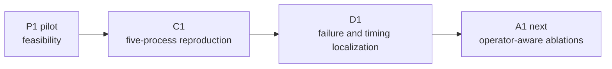

# PreciseMD

[](https://github.com/parkergurney/PreciseMD/actions/workflows/ci.yml)
[](LICENSE)

**PreciseMD is a reproducible GPU benchmarking and numerical-diagnostics
framework for reduced-precision machine-learning interatomic potentials.** It
tests whether faster arithmetic actually improves end-to-end energy-and-force
inference without introducing nonfinite forces, broken equivariance, or
configuration-dependent numerical error.

The completed NVIDIA A40 study found that blanket reduced precision was not a
useful optimization for MACE-OFF23-small: TF32 provided no measurable speedup,
while BF16 autocast was 9–12% slower at the model level and produced six
localized nonfinite failures on adversarial close-contact geometries. Operator
tracing placed the first observed BF16 discrepancy at an addition/accumulation
boundary and the first nonfinite values at downstream dense matrix
contractions. The result motivates targeted precision placement and optimized
equivariant kernels rather than blanket autocast.

## Results at a glance

| Policy | A40 performance | Numerical behavior | Outcome |
|---|---|---|---|
| FP32 | Operational baseline | Stable on ordinary and high-force diagnostics | Retain |
| TF32 | No demonstrated end-to-end speedup | Finite on all 27 D1 cases; sensitive on adversarial close contacts | No deployment benefit |
| BF16 AMP | 9–12% slower for prepared-model inference | Six localized nonfinite close-contact cases | Reject blanket autocast |

These are bounded results for one model, software stack, workload, and GPU.
The diagnostic set intentionally over-represents difficult configurations, so
six failures in 27 cases is not a population failure-rate estimate.

## What this project demonstrates

- Independent, isolated GPU benchmark processes with counterbalanced policy
  order and resumable outputs.
- Process-first hierarchical bootstrap confidence intervals that treat
  processes—not timing iterations—as independent experimental units.
- Immutable dataset freezing, SHA-256 provenance, model/configuration hashes,
  environment capture, and artifact validation.
- Continuous GPU telemetry and guards against dirty commits, wrong hardware,
  altered inputs, mixed trials, and accidental CPU benchmarking.
- Energy, force, finite-difference, equivariance, batching-invariance, and
  operator-level diagnostics for FP64, FP32, TF32, and BF16.
- Failure-preserving research workflows: numerical exceptions and nonfinite
  outputs remain outcomes rather than being silently excluded.

## Study progression



- **P1 — pilot:** TF32 was speed-neutral; BF16 was slower and returned six
  nonfinite results across the 300-frame stress-stratified dataset.
- **C1 — independent reproduction:** five fresh A40 processes confirmed the
  practical performance conclusion and motivated component-level diagnosis.
- **D1 — exploratory localization:** three independent timing processes plus
  one instrumented diagnostic process localized BF16's slowdown to forward and
  force-gradient execution and its failures to an
  accumulation-to-dense-contraction path.
- **A1 — planned:** protect candidate operations in FP32 one factor at a time
  and separately test compilation and optimized equivariant kernels.

The prospective design and decision rules are in the
[confirmatory protocol](studies/confirmatory-c1/protocol.md). Completed records
are preserved for [P1](studies/pilot-p1-a40/README.md) and
[D1](studies/d1-p1-a40/README.md).

## Architecture

```text
rMD17 inputs
    -> deterministic stratified frame selection
    -> immutable checksummed dataset
    -> isolated GPU trial directories + telemetry
    -> process-level validation and hierarchical analysis
    -> targeted numerical/operator diagnostics
    -> checksummed portable result bundle
```

The core is an installable Python package under `src/precision_md`. Experiment
settings live in versioned YAML, guarded shell entry points orchestrate rented
GPU runs, and compact study records keep large immutable artifacts out of Git.

## Quick start

Python 3.11 and [uv](https://docs.astral.sh/uv/) are the reference development
environment:

```bash
git clone https://github.com/parkergurney/PreciseMD.git
cd PreciseMD
uv sync --extra test
uv run pytest
uv run precisemd --help
```

The historical `precision-md` command remains as a compatibility alias so
frozen experiment commands and manifests stay reproducible.

GPU/MACE development uses the locked optional environment:

```bash
uv sync --extra ml --extra test
uv run precisemd --help
```

MACE checkpoints and rMD17 archives are supplied locally and are not
redistributed by this repository. Expected rMD17 inputs are
`data/rmd17/{ethanol,malonaldehyde,aspirin}.npz`, each containing `R` and either
`z` or `nuclear_charges`.

## Reproducing the studies

The complete A40 workflows are guarded, resumable entry points:

```bash
# Five independent C1 reproduction processes and combined analysis
scripts/run-a40-c1-reproduction.sh

# D1 component timing, operator tracing, analysis, and packaging
scripts/run-a40-d1.sh
```

The scripts verify the tagged code state, expected A40, immutable input hashes,
locked model, trial isolation, telemetry, and final checksums. See the
[protocol](studies/confirmatory-c1/protocol.md) and study records before
attempting a scientific reproduction; the scripts intentionally refuse
unfrozen or inconsistent runs.

Useful lower-level commands include:

```bash
uv run precisemd prepare-data --config configs/gate1.yaml
uv run precisemd benchmark --config configs/gate1.yaml --allow-gpu-benchmark
uv run precisemd analyze-trials --trials results/gate1 --output results/c1-analysis
uv run precisemd validate-d1 --config configs/d1-p1.yaml
```

## Repository layout

```text
configs/       Versioned experiment configurations
paper/         Manuscript source (work in progress)
scripts/       Guarded GPU workflows and validation utilities
src/           Installable PreciseMD implementation
studies/       Frozen study records and prospective protocol
tests/         Unit, artifact, analysis, and workflow regression tests
REFERENCES.md  Literature source index
```

Raw datasets, model checkpoints, generated results, and full result bundles
are intentionally excluded from Git. Study manifests record their hashes; a
persistent archival URL will be added before formal publication.

## Scope and next step

PreciseMD does not claim that reduced precision is unsuitable for all MLIPs.
The present evidence covers MACE-OFF23-small on one A40 software/hardware
environment. Close-contact frames are stress tests, FP32 is an operational
baseline rather than physical truth, and operator localization came from one
instrumented process.

The next experiment, A1, will test whether selective FP32 protection or
optimized kernels can recover a joint speed-and-reliability benefit. Only
policies passing finite-output, performance, and numerical criteria should
advance to cross-model, cross-hardware, or molecular-dynamics validation.

## License and citation

PreciseMD is released under the [MIT License](LICENSE). Software citation
metadata is provided in [CITATION.cff](CITATION.cff); add the study archive DOI
when it becomes available. The literature used to motivate and design the
study is indexed in [REFERENCES.md](REFERENCES.md).
